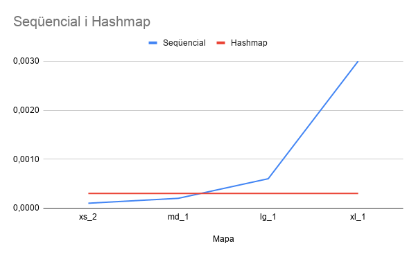
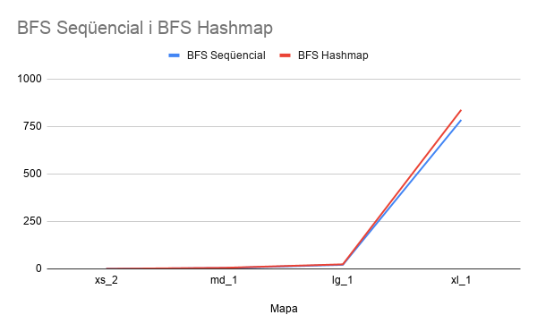
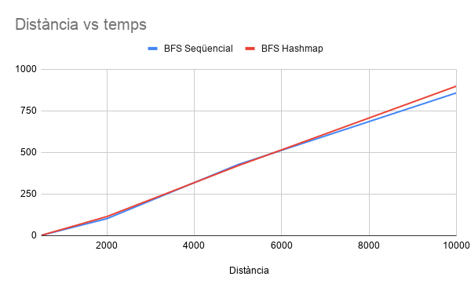

# Informe del Projecte: Building Google Maps

`Universitat Pompeu Fabra – Estructures de Dades i Algorismes (DSA) – 2025/26`

---

## 1. Anàlisi de Complexitat Temporal

### 1.1. Inicialització del mapa d'interseccions (Lab 5)

El mapa d'interseccions és una taula de hash on la clau és l'ID d'una intersecció i el valor és la llista de carrers que hi comencen. Per construir-lo, recorrem tots els segments de carrer i per cada un l'afegim a la llista de la seva intersecció d'origen. Sigui **N** el nombre total de segments de carrer:

- **Cas millor:** O(N) — cada segment va a un bucket diferent i no hi ha col·lisions. Cada inserció és O(1).
- **Cas mitjà:** O(N) — hi ha poques col·lisions i cada inserció és O(1).
- **Cas pitjor:** O(N²) — tots els segments cauen al mateix bucket i cal recórrer tota la llista per inserir cada element.

### 1.2. Trobar les coordenades d'un carrer o lloc donat el nom (Labs 2 i 3)

Per trobar un carrer o lloc, recorrem la llista d'un en un comparant el nom fins trobar-lo. Sigui **N** el nombre total de cases o llocs:

- **Cas millor:** O(1) — el primer element de la llista ja és el que busquem.
- **Cas mitjà:** O(N) — hem de recórrer aproximadament la meitat de la llista.
- **Cas pitjor:** O(N) — l'element és l'últim de la llista o no existeix.

### 1.3. Algorisme de cerca de camins (BFS)

El BFS explora el graf de carrers per capes fins a trobar la destinació. Sigui **V** el nombre d'interseccions i **E** el nombre de segments de carrer:

- **Cas millor:** O(1) — l'origen i la destinació són el mateix segment o adjacents.
- **Cas mitjà:** O(V + E) — el BFS visita cada intersecció i segment com a màxim una vegada.
- **Cas pitjor:** O(V + E) — cal explorar tot el graf abans de trobar la destinació.

> **Nota:** A la nostra implementació, comprovar si una intersecció ja ha estat visitada es fa recorrent tota la cua, amb cost O(V) per comprovació. Això fa que el pitjor cas real sigui O(V · (V + E)).

---

## 2. Anàlisi Experimental de Latència

> Les dades s'han obtingut mesurant el temps d'execució amb `clock()` de C, repetint cada mesura múltiples vegades sobre la mateixa màquina. Els mapes utilitzats són xs\_2, md\_1, lg\_1 i xl\_1.

### 2.1. Latència per trobar carrers connectats segons la mida del mapa

#### Dades en brut

| Mapa  | Interseccions | Latència seqüencial (ms) | Latència hashmap (ms) |
|-------|:-------------:|:------------------------:|:---------------------:|
| xs\_2 | 71            | 0.0016                   | 0.0026                |
| md\_1 | 1.122         | 0.0098                   | 0.0034                |
| lg\_1 | 3.283         | 0.0890                   | 0.0046                |
| xl\_1 | 15.378        | 0.4780                   | 0.0036                |

#### Gràfica

#### Explicació

Amb la cerca seqüencial, per trobar els carrers connectats a una intersecció cal recórrer tota la llista de segments un per un. Com més gran és el mapa, més segments hi ha i més triga. Per això el temps creix amb la mida del mapa. 

Amb el hashmap, podem accedir directament als carrers d'una intersecció donada la seva ID, sense recórrer res. Per això el temps es manté pràcticament igual independentment de la mida del mapa.

---

### 2.2. Latència per trobar un camí segons la mida del mapa

#### Dades en brut

| Mapa   | Interseccions | BFS + seqüencial (ms) | BFS + hashmap (ms) |
|--------|:-------------:|:---------------------:|:------------------:|
| xs\_2  | 71            | 0.0588                | 0.1212             |
| md\_1  | 1.122         | 4.3270                | 5.6186             |
| lg\_1  | 3.283         | 21.4390               | 23.9040            |
| xl\_1  | 15.378        | 784.6264              | 837.5526           |

#### Gràfica

##### Explicació

Els temps del BFS amb hashmap i amb cerca seqüencial surten molt similars. Això passa perquè el punt lent del nostre BFS no és buscar els carrers veïns, sinó comprovar si una intersecció ja ha estat visitada. Per fer aquesta comprovació recorrem tota la llista de nodes ja explorats un per un, i això triga igual tant si usem hashmap com si no.

Per veure una diferència real entre les dues versions caldria també millorar la manera de guardar els nodes visitats, tal com es proposa a la secció 3.

---

### 2.3. Latència per trobar un camí segons la distància entre origen i destinació

#### Dades en brut

| Distància aprox. (m) | Origen → Destinació     | BFS + seqüencial (ms) | BFS + hashmap (ms) |
|:--------------------:|-------------------------|:---------------------:|:------------------:|
| ~500                 | UPF → Parc Ciutadella   | 1.8840                | 1.8590             |
| ~2.000               | UPF → Estació de França | 102.0760              | 114.7150           |
| ~5.000               | UPF → Glòries           | 426.8480              | 419.9430           |
| ~10.000              | UPF → L'Illa Diagonal   | 857.9760              | 898.4270           |

#### Gràfica

##### Explicació i ajust de corba

Com més lluny és la destinació, més interseccions ha d'explorar el BFS i més triga. Els temps creixen de forma pronunciada a distàncies llargues perquè a la nostra implementació comprovar els nodes visitats costa O(V) per cada pas, fent que el comportament real s'acosti a O(V²).

Els temps del BFS amb hashmap i seqüencial tornen a ser similars pel mateix motiu que a la secció 2.2: el punt lent és la llista de visitats, no la cerca de veïns.

---

## 3. Millora de l'Estructura de Dades de Visitats al BFS

**Estructura proposada:** taula de hash (hashmap)

Al nostre BFS, cada vegada que trobem un carrer veí hem de comprovar si ja l'hem visitat. Ara ho fem mirant tota la llista de carrers ja explorats un per un, cosa que és lenta (O(V) per cada comprovació). Si en lloc d'una llista usem un hashmap on la clau és l'ID de la intersecció, podem saber en un sol pas si ja ha estat visitada (O(1)).

| Operació              | Llista (actual) | Hashmap (millora) |
|-----------------------|:---------------:|:-----------------:|
| Comprovar si visitat  | O(V)            | O(1)              |
| Marcar com a visitat  | O(1)            | O(1)              |
| **Total BFS**         | O(V · (V+E))    | O(V + E)          |

**Inconvenients:**
- Ocupa més memòria que una llista simple.
- En mapes molt petits pot ser lleugerament més lent per la inicialització.
- Si molts elements cauen al mateix bucket, el pitjor cas segueix sent O(V).

---

## 4. Millora per Trobar el Segment de Carrer més Proper a unes Coordenades

**Situació actual:** Per trobar el carrer més proper a una posició, mirem tots els segments un per un i calculem la distància. Complexitat: **O(N)**.

**Millora proposada:** Llista ordenada per latitud + cerca binària

La idea és ordenar tots els segments per latitud quan carreguem el mapa. Quan volem trobar el carrer més proper, en lloc de mirar-los tots, usem cerca binària per anar directament als segments amb latitud semblant a la nostra posició i només calculem la distància d'aquells.

| Operació    | Llista sense ordenar (actual) | Llista ordenada + cerca binària |
|-------------|:-----------------------------:|:-------------------------------:|
| Construcció | O(N)                          | O(N log N)                      |
| Cerca       | O(N)                          | O(log N + K)                    |

On K és el nombre de segments amb latitud propera a la coordenada buscada.

Com que l'ordenació es fa una sola vegada en carregar el mapa, el cost extra val la pena si després fem moltes cerques.

**Inconvenients:**
- Ordenar per latitud no sempre troba el carrer més proper: dos carrers poden tenir latitud semblant però estar molt lluny si tenen longitud molt diferent.
- Ordenar triga O(N log N) en lloc de O(N).
- Si afegim o eliminem carrers del mapa caldria tornar a ordenar.